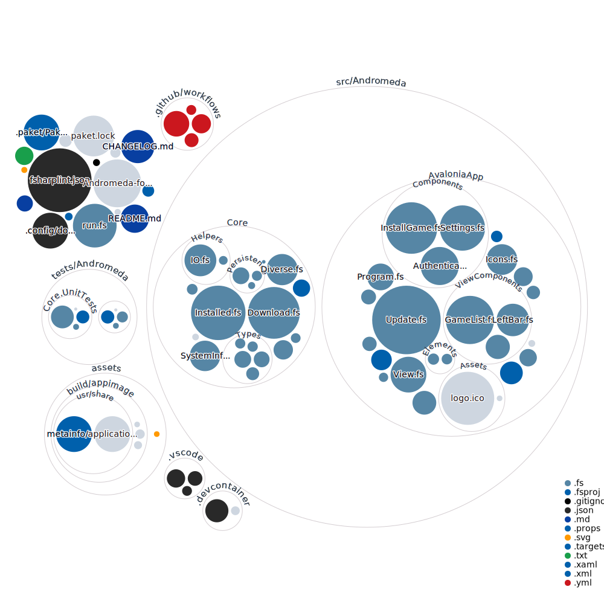

# Development

## Setup (VSCode)

The only supported way to work on this is by using the provided devcontainer
(https://marketplace.visualstudio.com/items?itemName=ms-vscode-remote.vscode-remote-extensionpack).
Therefore you need VSCode and Docker installed on your system, the rest is happening inside the container.

If VS Code does not suggest to open the repository with the container, run the "Remote-Container:
Rebuild and Reopen in Container" Action. Everything you need is installed in there.

## Building

To build simply run dotnet build.

## Publishing

Publishing is done automatically with every commit on develop and for every release tag.

There is a bash script which bundles Andromeda in all the designated forms: `./scripts/publish.sh`
It is possible that you need additional dependencies to run this.

## Versioning

This project uses Semantic Versioning 2.0.0 (<http://semver.org/spec/v2.0.0.html>).

## Used Tools

The code is written in "Visual Studio Code" (<https://code.visualstudio.com/>). There is a
.devcontainer defined, which you can use from within VScode or from a service like GitHub Codespaces.
